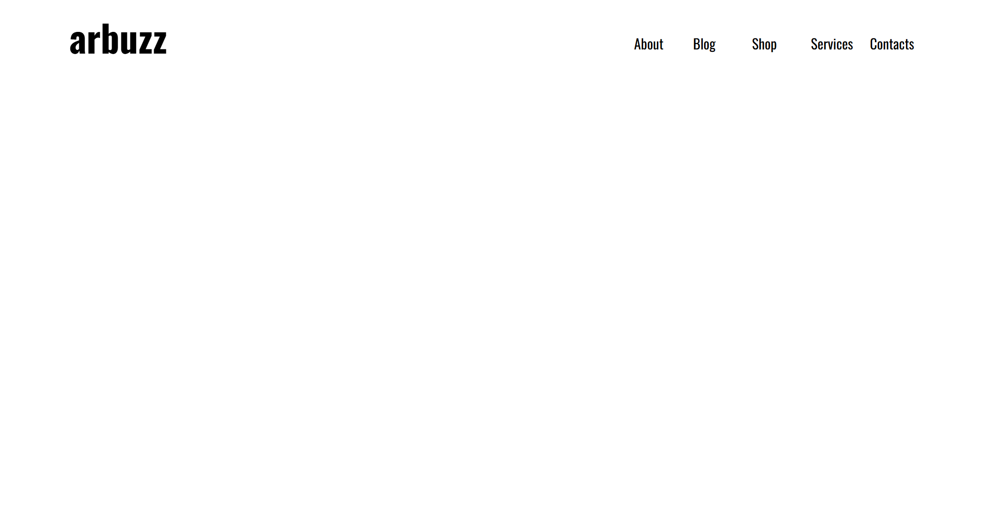
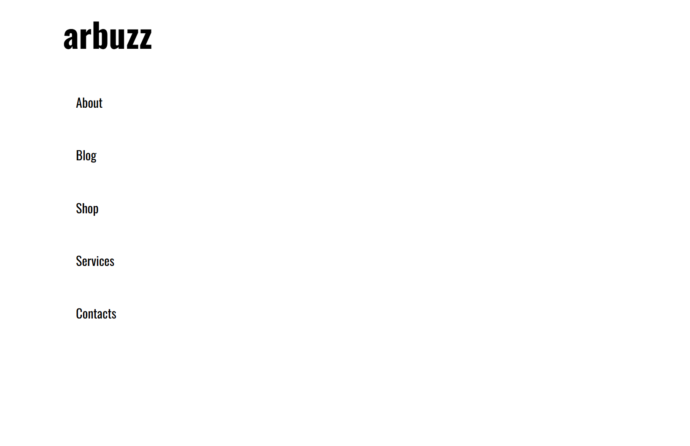
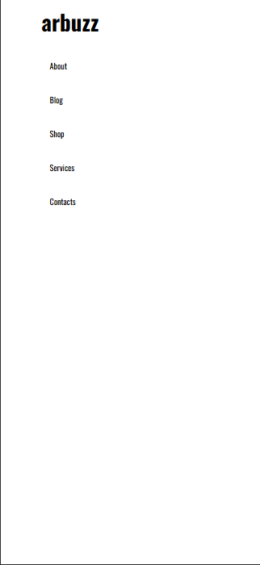

# Navbar - Responsive Design

Navbar Responsive Design adalah sebuah navbar yang dapat berubah bentuk seiring dengan pergantian size dari sebuah layar. Dalam set up sebuah breakpoint nya ada dalam size large kebawah akan dibuat menurun yang nantinya memudahkan penggunaan sebuah website.

## Hasil Pekerjaan

1. Hasil dengan 1080px

2. Hasil dengan 768 px

3. Hasil dengan ratio Iphone 14 pro

## Cara menjalankan app

1. Buka file index.html.
2. lalu masuk ke dalam developer mode dengan shorcut ctrl + shift + i.
3. Ubahlah rasio yang sesuai dengan keinginan seperti di hasil pekerjaan.

